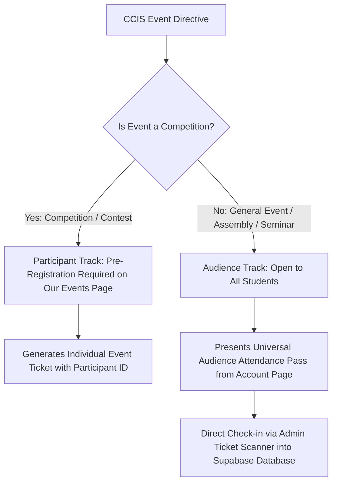

# CCIS Student Council — Official Design System & Branding Guidelines

This document serves as the authoritative, comprehensive design system specification for the **College of Computing and Information Sciences (CCIS) Student Council** centralized website and portal at the **University of Makati (UMak)**.

It establishes the official visual language, color tokens (**Green `#123524`** & **Yellow `#FFBC00`**), typography hierarchy, 1px crisp border tokens, event attendance architectures, and component geometries to ensure 100% brand consistency across all existing and future CCIS systems.

---

## 1. Core Brand Colors & Palette Tokens

The CCIS portal maintains a distinct organizational palette combining **CCIS Green (`#123524`)**, **CCIS Yellow (`#FFBC00`)**, and **Cream (`#FAF7EA`)** with UMak-compliant semantic states.

### 1.1 CCIS Brand Colors (Primary Identity)
*Do NOT change these brand colors to generic navy or standard green; CCIS Green (`#123524`) and CCIS Yellow (`#FFBC00`) are the official identity colors of the CCIS Student Council.*

| Token / Usage | Hex Code | Tailwind Utility / CSS | Description & Purpose |
| :--- | :--- | :--- | :--- |
| **CCIS Green** (Primary Brand) | `#123524` | `bg-[#123524]`, `text-[#123524]`, `border-[#123524]` | Primary identity color: headers, navbars, hero backgrounds, primary buttons, card accents |
| **CCIS Green Hover** | `#1a4a33` / `#163e2b` | `hover:bg-[#1a4a33]` | Hover state for primary green interactive elements |
| **CCIS Deep Green Surface** | `#0b2116` | `bg-[#0b2116]` | Drawer backgrounds, dark gradient origins, high-contrast modal footers |
| **CCIS Yellow / Gold** (Secondary Accent) | `#FFBC00` | `bg-[#FFBC00]`, `text-[#FFBC00]`, `border-[#FFBC00]` | Secondary brand accent: active tabs, highlights, key badges, icons, focus rings |
| **CCIS Yellow Hover** | `#ffd043` | `hover:bg-[#ffd043]` | Hover state for yellow buttons and interactive badges |
| **CCIS Cream** (Light Page Surface) | `#FAF7EA` | `bg-[#FAF7EA]`, `text-[#FAF7EA]` | Default overall body/page background (`#FAF7EA`) |
| **Crisp Council Border** | `rgba(18, 53, 36, 0.22)` | `border-[#123524]/25` | Standard 1px visible council border on cards, inputs, and tables |
| **Mascot Identity** | *Herons* | Use "Herons" when addressing CCIS students (e.g. *Official Heron*, *Heron Attendees*) |

---

### 1.2 Neutral & Surface Tokens

| Role | Color / Hex | Tailwind / CSS Example | Usage |
| :--- | :--- | :--- | :--- |
| **Page Background** | `#FAF7EA` (Cream) | `bg-[#FAF7EA]` | Portal background for all public and authenticated student pages |
| **Card / Surface Background** | `#FFFFFF` | `bg-white` | Content containers, modals, form panels, event cards |
| **Muted Surface** | `#F5F5F4` (Stone 100) | `bg-stone-100` | Input backgrounds, calendar day headers, preview badges |
| **Primary Text** | `#1C1917` (Stone 900) | `text-stone-900` | Primary headings, table text, high-contrast labels |
| **Secondary Text** | `#5E6E64` / `#57534E` | `text-[#5E6E64]` | Subtitles, metadata, captions, date stamps |
| **Admin Dark Highlight** | `#09090B` / `#18181B` | `bg-zinc-950` | Admin login page backgrounds, terminal preview blocks |

---

### 1.3 Semantic State Badges & Alert Tokens
*Per UMak standards: Badges and status indicators must use accessible, solid semantic colors with matching border tints.*

```tsx
// Official Semantic Badge Variants
const VARIANT_CLASSES = {
  success: 'bg-emerald-100 text-emerald-800 border-emerald-200', // Approved / Verified / Attended / Valid Pass
  warning: 'bg-amber-100 text-amber-800 border-amber-200',       // Pending / Review Required / In Progress
  danger:  'bg-rose-100 text-rose-800 border-rose-200',          // Rejected / Banned / Cancelled / Error
  info:    'bg-blue-100 text-blue-800 border-blue-200',          // General News / Directives / Announcements
  neutral: 'bg-stone-100 text-stone-700 border-stone-200',       // Draft / Archived / Closed
};
```

---

## 2. Typography Rules & System

The CCIS design system pairs **Marcellus** (scholastic serif) for all headings with **Metropolis** (geometric sans-serif) for body text and UI controls.

### 2.1 Font Families

| Role | Font Family | Configured Fallback | Applied Elements |
| :--- | :--- | :--- | :--- |
| **Headings & Titles (Serif)** | `Marcellus` | `'Marcellus', Georgia, serif !important` | **ALL Headings** (`h1`, `h2`, `h3`, `h4`, `h5`, `h6`), Hero slogan (*"Code. Create. Connect."*), `.font-marcellus`, page titles, section titles, card headlines |
| **Body & UI Controls (Sans)** | `Metropolis` | `"Metropolis", ui-sans-serif, system-ui, sans-serif` | **ALL Body text**, paragraphs (`p`), buttons, navigation links, form labels, inputs, tables, descriptions, badges |
| **Data & Tokens (Mono)** | `JetBrains Mono` | `ui-monospace, monospace` | Student IDs, QR security tokens, timestamps, IP addresses, log entries |

### 2.2 Global CSS Configuration (`index.css`)

```css
/* Global Typography Hierarchy */
h1, h2, h3, h4, h5, h6, .font-marcellus {
  font-family: 'Marcellus', Georgia, serif !important;
}

body, p, span, label, input, button, select, textarea, div {
  font-family: "Metropolis", ui-sans-serif, system-ui, sans-serif;
}

/* Headings inherit Marcellus with crisp letter-spacing */
h1 { @apply font-marcellus tracking-tight; }
h2 { @apply font-marcellus tracking-tight; }
h3 { @apply font-marcellus; }
h4 { @apply font-marcellus; }
```

---

## 3. Crisp 1px Council Border Standard

On large high-resolution and high-DPI displays, standard gray/faint borders (`border-gray-100`) wash out and become invisible.

### 3.1 Council Border Token Rule
All cards, tables, inputs, sidebars, calendar grids, search bars, and modals MUST use the visible 1px council border token:

```tsx
// Tailwind utility standard
className="border border-[#123524]/25 shadow-xs"

// On dark surfaces or hover states
className="border border-[#123524]/25 hover:border-[#123524] transition-all"
```

### 3.2 Admin Dashboard Automated Border Injections (`#admin-root`)
In `index.css`, `#admin-root` rules automatically enforce 1px council borders:
- `.bg-white`, `article`, and admin cards receive `border: 1px solid rgba(18, 53, 36, 0.22) !important;`
- Tables (`th`, `td`) receive crisp dividing lines `border-color: rgba(18, 53, 36, 0.15) !important;`
- Inputs, selects, and textareas receive visible borders `border: 1px solid rgba(18, 53, 36, 0.28) !important;`

---

## 4. Icon System (No Emojis Policy)

> 🚫 **STRICT RULE: NO EMOJIS IN UI TEXT OR CARDS.**  
> Emojis (e.g. 🏆, 🎓, 🎟️, 🖼️, 📅, 🎉) render inconsistently across platforms and look unpolished. Always use official **Lucide-React** SVG icons.

| Category / Entity | Lucide Icon | Component Usage | Example |
| :--- | :--- | :--- | :--- |
| **Competitions / Hackathons** | `Trophy` | `<Trophy size={14} className="text-[#FFBC00]" />` | Event badges, participant CTA |
| **General Events / Seminars** | `GraduationCap` | `<GraduationCap size={14} className="text-emerald-700" />` | General Assemblies, webinars |
| **Universal Attendance QR** | `QrCode` | `<QrCode size={14} className="text-[#123524]" />` | Audience pass cards & CTAs |
| **Tickets & Passes** | `Ticket` | `<Ticket size={14} />` | Participant registration cards |
| **Calendar / Schedules** | `Calendar` / `CalendarDays` | `<Calendar size={14} />` | Date stamps, timetable headers |
| **Banners / Media** | `ImageIcon` | `<ImageIcon size={14} />` | Image thumbnails, gallery modals |
| **Notices & Directives** | `Sparkles` | `<Sparkles size={14} className="text-[#FFBC00]" />` | Audience entry notices |

---

## 5. Event Architecture: Participants vs. Audiences

The CCIS portal implements a clear, two-tier event model:



### 5.1 Competition Track (Participants)
- **Target**: Students joining as competitors, teams, hackathon entrants.
- **Action**: Register via the **Our Events** page (`Registration.tsx`).
- **Badge**: `<Trophy size={12} /> Competition` (Amber badge).
- **CTA**: `"Register as Participant"` (Directs to slot-checked registration modal).

### 5.2 General Event Track (Audiences)
- **Target**: All general attendees, students attending seminars, webinars, convocations, or general assemblies.
- **Action**: No pre-registration required.
- **Badge**: `<GraduationCap size={12} /> General Event` (Emerald badge).
- **CTA**: `"Get Universal Attendance QR"` (Directs to student's Account page).
- **Hover State**: Text and icons MUST transition cleanly to `#FFBC00` or white without turning invisible.

### 5.3 Universal Audience Attendance Pass Architecture
- **Location**: Generated on [`AccountPage.tsx`](file:///c:/Users/gio%20joshua%20gonzales/OneDrive/Desktop/ccis_website/src/pages/AccountPage.tsx).
- **Format**: `CCIS-{student_number}-{token}` stored in `profiles.attendance_qr_code` and `profiles.attendance_qr_generated_at`.
- **Validation**: High-contrast, compact QR code easily scanned by mobile cameras even in low lighting.
- **Scanner**: [`TicketScanner.tsx`](file:///c:/Users/gio%20joshua%20gonzales/OneDrive/Desktop/ccis_website/src/admin/sections/TicketScanner.tsx) validates the pass against the `profiles` database, instantly logging attendance with sound & visual cues.

---

## 6. Component Geometry & Standards

### 6.1 Navigation Bar (`NavBar.tsx`)
- **Height**: `h-16` (64px) sticky top header with `backdrop-blur-md`.
- **Background**: `bg-[#123524]` (CCIS Green) with bottom border `border-b border-[#FFBC00]/20`.
- **Brand Block**:
  - Logo: 44×44px circular council seal with `bg-[#FAF7EA] border border-[#FFBC00]`.
  - Text: `College of Computing Information Sciences` split cleanly across 2 lines.
- **Active Navigation Link**: `text-[#FFBC00] border-b-2 border-[#FFBC00]`.
- **Pill Tabs Bar**: Single-row horizontal scrollable container (`flex flex-nowrap overflow-x-auto gap-2 border-b border-[#123524]/20 pb-3`).

### 6.2 Hero Section (`Hero.tsx`)
- **Background**: `bg-[#123524]` with dark radial/linear gradient overlays.
- **Headline**: *"Code. Create. Connect."* MUST use `font-marcellus text-white uppercase`.
- **Primary CTA**: `bg-[#FFBC00] text-[#123524] font-black uppercase tracking-widest hover:bg-[#ffd043] rounded-xl`.
- **Secondary CTA**: `border border-white/30 text-white/90 hover:bg-white/10 font-bold text-xs uppercase tracking-widest rounded-xl`.

### 6.3 Event & Content Cards
- **Geometry**: `rounded-3xl bg-white border border-[#123524]/25 shadow-xs hover:shadow-lg hover:border-[#123524]/60 transition-all duration-300`.
- **Thumbnail / Banner**: `rounded-2xl overflow-hidden border border-[#123524]/15`.
- **Card Headings**: Always use `font-marcellus text-[#123524]`.

### 6.4 Footer (`Footer.tsx`)
- **Background**: `bg-[#123524] text-[#FAF7EA] py-12 border-t-2 border-[#FFBC00]`.
- **Brand Column**: Circular seal with double yellow accent rings beside council name.
- **Copyright**: `© [Year] College of Computing and Information Sciences Student Council. All Rights Reserved.`

---

## 7. Security & Database Standards

1. **Per-Profile Bans**: Use `profiles.banned` and `profiles.banned_until`. Avoid network-wide IP bans to prevent locking shared campus WiFi subnets.
2. **Institutional Access**: Require `@umak.edu.ph` email for student registration. Admin exceptions are handled by the private database allowlist.
3. **Load Test & Anonymous Purging**: Use [`supabase/33_clean_loadtest_and_test_users.sql`](file:///c:/Users/gio%20joshua%20gonzales/OneDrive/Desktop/ccis_website/supabase/33_clean_loadtest_and_test_users.sql) or the Admin **"Purge Load Test Users"** RPC action to maintain a pristine student database.
4. **Production Headers**: Strict CSP, `X-Frame-Options: DENY`, and `X-Content-Type-Options: nosniff` configured in `vercel.json`.
