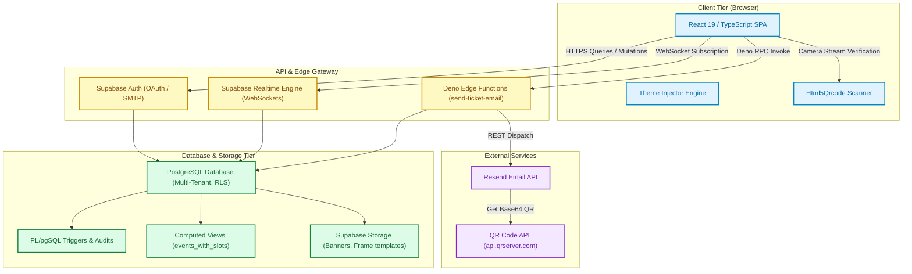
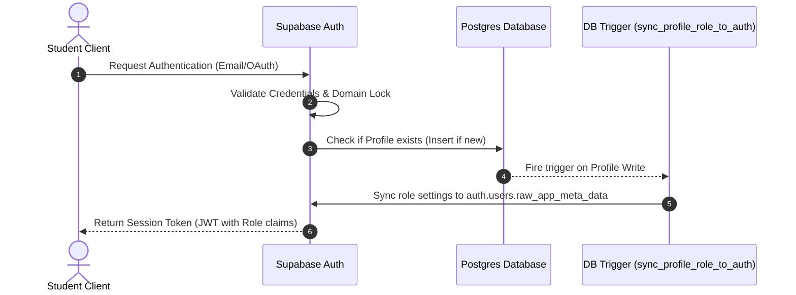
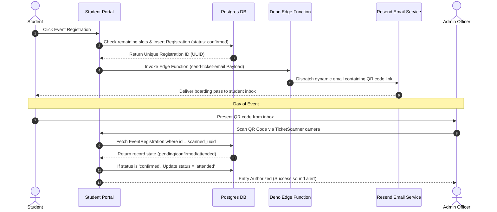
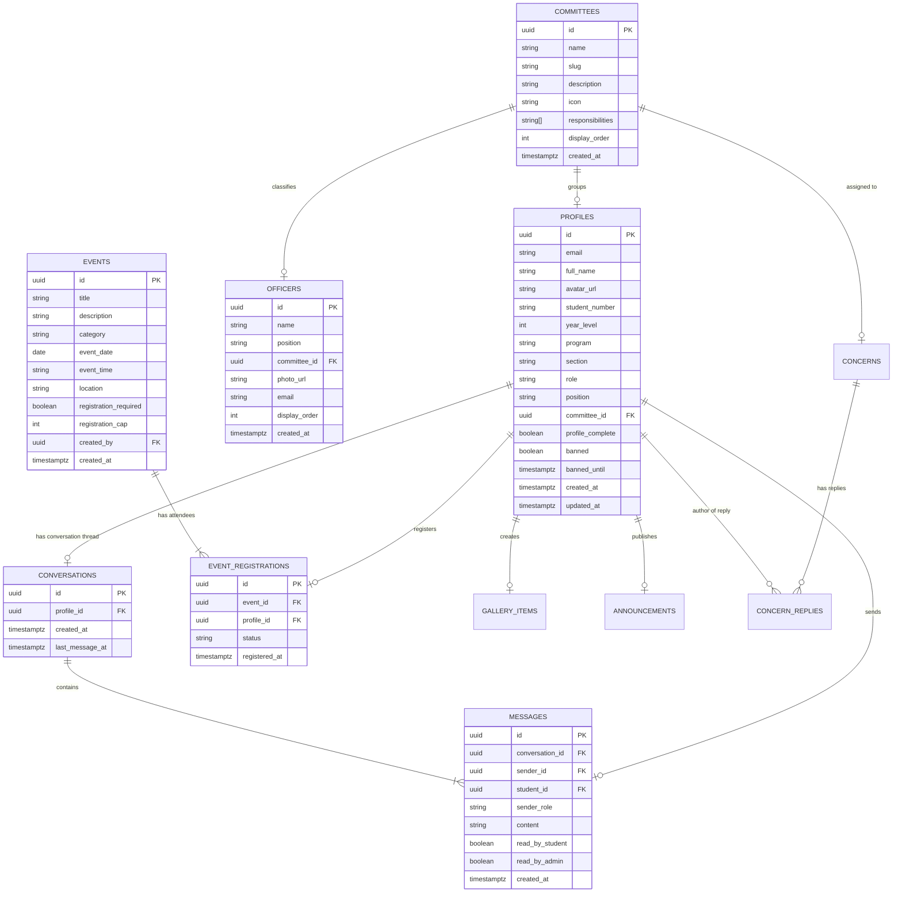

# 🎓 CCIS Student Council Centralized Platform — System Documentation

This document provides a comprehensive technical overview of the **College of Computer and Information Sciences (CCIS) Student Council Centralized Platform**. It details the architectural paradigms, design patterns, database schemas, and security controls, ending with recommendations for future scalability and optimization.

---

## 🏗️ 1. System Architecture

The application is engineered as a modern, decoupled client-server architecture. It features a highly interactive React single-page application (SPA) on the frontend, supported by a scalable BaaS (Backend-as-a-Service) layer provided by Supabase, combined with serverless edge logic and third-party API services.

### 🌐 Architectural Components



1. **Client Tier (Frontend)**:
   * A single-page application built using **React 19**, **Vite 6**, and **TypeScript**.
   * Implements a **Dynamic Theme System** that syncs with database-defined theme presets.
   * Utilizes **GSAP (GreenSock)** for timeline-based animations and landing transitions.
   * Utilizes **Html5Qrcode** to handle client-side webcam decoding for physical QR-ticket scanning.

2. **Backend Services (BaaS)**:
   * **Supabase** handles authentication (Google OAuth + Email/Password logins), database storage (PostgreSQL), storage buckets for static media assets, and WebSockets for real-time announcements/chats.
   * Enforces security at the database row-level using PostgreSQL **Row Level Security (RLS)**.

3. **Serverless Edge Layer**:
   * **Supabase Edge Functions** (written in TypeScript/Deno) process background workflows such as generating security QR keys and dispatching automated emails.

4. **Third-Party Services**:
   * **Resend API**: Handles SMTP dispatch of dynamic HTML boarding passes.
   * **QR Code Server API**: Dynamically renders ticket IDs into visual matrix codes embedded directly in the boarding pass.

---

## 🛠️ 2. Technology Stack

| Technology | Layer | Role / Choice Rationale |
| :--- | :--- | :--- |
| **React 19** | Frontend Core | Component-driven UI, fast virtual DOM rendering, and concurrent capabilities. |
| **TypeScript 5+** | Programming Language | Compile-time type safety, mirroring backend database entity types. |
| **Vite 6** | Build System | Instant Hot Module Replacement (HMR) and highly optimized ESBuild bundling. |
| **Tailwind CSS v4** | UI Styling | Utility-first styling combined with real-time CSS Custom Properties. |
| **GSAP 3** | Animations | Complex, hardware-accelerated timeline animations and scrolls. |
| **Supabase (PostgreSQL)**| Data Layer | Relational database modeling, native real-time subscriptions, and robust RBAC. |
| **Deno / TypeScript** | Edge Computing | Lightweight, zero-cold-start serverless logic executing close to users. |
| **Html5Qrcode** | Scanner Service | Fast canvas-based image processing for decoding QR codes. |
| **Resend API** | Communication | Developer-centric transactional email delivery with custom HTML bodies. |

---

## 🎨 3. System Design & Design Patterns

### A. Authentication & Institutional Security Flow
* **Domain Lock**: The system restricts account signup to emails ending in `@umak.edu.ph`. The main developer account (`ggiojoshua2006@gmail.com`) is explicitly exempt.
* **Metadata Sync (JWT Trigger)**: Roles changes in the public database table are immediately synchronized with the user's Auth metadata (`raw_app_meta_data`) via a database trigger. This enables JWT-based role assertions, eliminating redundant database lookups during RLS evaluations.



### B. Role-Based Access Control (RBAC) Matrix
Administrative paths and database resources are secured through specific user roles:
* **DevCom Head**: Full system capabilities. Able to modify officers, committees, settings, themes, and manage user accounts/bans.
* **Comm — Content**: Manage faqs, events, calendar updates, and announcements.
* **Comm — Registration**: Read dashboard analytics, view event registrations, and scan/validate tickets.
* **Comm — Photobooth**: Control photo gallery configurations and custom photobooth overlays.
* **Officer (Read-Only)**: Read telemetry dashboards and view concerns queue.
* **Student**: Read public resources, register for events, view ticket codes, and exchange real-time messages.

### C. Live Event Capacity Engine
Instead of checking capacity in unstable frontend scripts, event bookings are protected using a database view (`events_with_slots`) and transactional integrity controls:
* **Database View**: Automatically calculates the number of registered attendees and outputs `slots_left`.
* **Unique Constraints**: Ensures that a user cannot register for the same event multiple times.

### D. Dynamic CSS Theme System
Real-time custom colors are managed via Tailwind custom utilities and CSS properties:
1. Active theme configurations (Primary color, Accent color, Canvas background) are fetched on app launch in [RootRouter.tsx](file:///c:/Users/gio%20joshua%20gonzales/OneDrive/Desktop/ccis_website/src/RootRouter.tsx).
2. The values are mapped to CSS custom variables in the document root:
   ```typescript
   document.documentElement.style.setProperty('--color-primary-green', colors.primaryGreen);
   ```
3. Custom helper functions like `lightenColor` compute secondary interaction styles (hover outlines and overlays) dynamically.

### E. Event Boarding Pass & QR Scanner Architecture
When a student registers, the system initiates a secure sequence to issue and verify entry passes:



---

## 🗄️ 4. Database Schemas

All schemas reside under the `public` schema in the Supabase PostgreSQL database. Row-Level Security (RLS) is enabled on all tables.

### Table: `profiles`
Holds the core identity records for all registered accounts.
* **Columns**:
  * `id` (`UUID`, Primary Key) -> References `auth.users(id)`
  * `email` (`TEXT`, Not Null, Unique)
  * `full_name` (`TEXT`, Nullable)
  * `avatar_url` (`TEXT`, Nullable)
  * `student_number` (`TEXT`, Nullable)
  * `year_level` (`INTEGER`, Nullable)
  * `program` (`TEXT`, Nullable)
  * `section` (`TEXT`, Nullable)
  * `role` (`UserRole`, Default `'student'`)
  * `position` (`TEXT`, Nullable)
  * `committee_id` (`UUID`, Nullable) -> References `committees(id)` ON DELETE SET NULL
  * `profile_complete` (`BOOLEAN`, Default `false`)
  * `banned` (`BOOLEAN`, Default `false`)
  * `banned_until` (`TIMESTAMPTZ`, Nullable)
  * `created_at` (`TIMESTAMPTZ`, Default `now()`)
  * `updated_at` (`TIMESTAMPTZ`, Default `now()`)
* **Constraints**:
  * Check Constraint (`check_profile_email_domain`): Checks that email ends with `@umak.edu.ph` (exempting admin account).
  * Check Constraint (`check_profile_name_length`): Enforces length limit <= 255 characters.
  * Check Constraint (`check_profile_section`): Section must follow alphanumeric uppercase pattern (e.g. `ACSAD`, `A-APPDEV`).
* **Triggers**:
  * `check_profile_metadata_trigger`: Runs prior to write operations to enforce constraints.
  * `trigger_sync_profile_role_to_auth`: Syncs roles to `auth.users` metadata when a user's role is updated.

### Table: `committees`
Represents student council committees (Logistics, Finance, technical, etc.).
* **Columns**:
  * `id` (`UUID`, Primary Key)
  * `name` (`TEXT`, Not Null)
  * `slug` (`TEXT`, Unique)
  * `description` (`TEXT`, Nullable)
  * `icon` (`TEXT`, Nullable)
  * `responsibilities` (`TEXT[]`, Default `{}`)
  * `display_order` (`INTEGER`, Default `0`)
  * `created_at` (`TIMESTAMPTZ`, Default `now()`)
* **Policies**:
  * Select: Publicly readable by all users.
  * Write (All): Only readable and writeable by role `'devcom_head'`.

### Table: `committee_subteams`
Maintains nested groupings within specific committees.
* **Columns**:
  * `id` (`UUID`, Primary Key)
  * `committee_id` (`UUID`) -> References `committees(id)` ON DELETE CASCADE
  * `name` (`TEXT`, Not Null)
  * `description` (`TEXT`, Nullable)
  * `display_order` (`INTEGER`, Default `0`)

### Table: `officers`
Stores directory details for CCIS Student Council officers.
* **Columns**:
  * `id` (`UUID`, Primary Key)
  * `name` (`TEXT`, Not Null)
  * `position` (`TEXT`, Not Null)
  * `committee_id` (`UUID`) -> References `committees(id)` ON DELETE SET NULL
  * `photo_url` (`TEXT`, Nullable)
  * `email` (`TEXT`, Nullable)
  * `display_order` (`INTEGER`, Default `0`)
  * `created_at` (`TIMESTAMPTZ`, Default `now()`)
* **Policies**:
  * Select: Publicly readable.
  * Write: DevCom Head only.

### Table: `events`
Details scheduled events on the council's roadmap.
* **Columns**:
  * `id` (`UUID`, Primary Key)
  * `title` (`TEXT`, Not Null)
  * `description` (`TEXT`, Nullable)
  * `category` (`'general' | 'priority'`, Default `'general'`)
  * `event_date` (`DATE`, Not Null)
  * `event_time` (`TEXT`, Nullable)
  * `location` (`TEXT`, Nullable)
  * `registration_required` (`BOOLEAN`, Default `true`)
  * `registration_cap` (`INTEGER`, Nullable)
  * `created_by` (`UUID`) -> References `profiles(id)` ON DELETE SET NULL
  * `created_at` (`TIMESTAMPTZ`, Default `now()`)

### Table: `event_registrations`
Tracks bookings submitted by students for specific events.
* **Columns**:
  * `id` (`UUID`, Primary Key)
  * `event_id` (`UUID`, Not Null) -> References `events(id)` ON DELETE CASCADE
  * `profile_id` (`UUID`, Not Null) -> References `profiles(id)` ON DELETE CASCADE
  * `status` (`'confirmed' | 'pending' | 'cancelled' | 'attended'`, Default `'confirmed'`)
  * `registered_at` (`TIMESTAMPTZ`, Default `now()`)
* **Constraints**:
  * Unique Constraint (`unique_event_profile`): Prevents multiple bookings by the same profile for a single event.

### Table: `conversations`
Maintains chat threads created between students and administrators.
* **Columns**:
  * `id` (`UUID`, Primary Key)
  * `profile_id` (`UUID`, Unique) -> References `profiles(id)` ON DELETE CASCADE
  * `created_at` (`TIMESTAMPTZ`, Default `now()`)
  * `last_message_at` (`TIMESTAMPTZ`, Default `now()`)
* **Policies**:
  * Select/Insert: Users can only select or insert their own conversation thread.
  * Admin Select: Admins (`devcom_head` or `officer`) can read all conversations.

### Table: `messages`
Stores actual chat records.
* **Columns**:
  * `id` (`UUID`, Primary Key)
  * `conversation_id` (`UUID`) -> References `conversations(id)` ON DELETE CASCADE
  * `sender_id` (`UUID`) -> References `profiles(id)` ON DELETE CASCADE
  * `student_id` (`UUID`) -> References `profiles(id)` ON DELETE CASCADE
  * `sender_role` (`'student' | 'admin'`, Not Null)
  * `content` (`TEXT`, Not Null)
  * `read_by_student` (`BOOLEAN`, Default `false`)
  * `read_by_admin` (`BOOLEAN`, Default `false`)
  * `created_at` (`TIMESTAMPTZ`, Default `now()`)
* **Indexes**:
  * `idx_messages_conversation` (Composite: `conversation_id`, `created_at`)
* **Triggers**:
  * `trigger_populate_message_student_id`: Pre-populates the `student_id` field using the conversation metadata before insertion to ensure subquery-free RLS checks.
  * `trigger_update_conversation_last_message_at`: Automatically updates `last_message_at` on the parent conversation.
* **Policies**:
  * Select (`messages_select_policy`): Subquery-free JWT claim validation:
    ```sql
    CREATE POLICY messages_select_policy ON public.messages
      FOR SELECT USING (
        auth.uid() = student_id 
        OR coalesce(auth.jwt() -> 'app_metadata' ->> 'role', 'student') IN ('devcom_head', 'officer')
        OR auth.jwt() ->> 'email' = 'ggiojoshua2006@gmail.com'
      );
    ```

### Table: `faqs`
* **Columns**:
  * `id` (`UUID`, Primary Key)
  * `question` (`TEXT`, Not Null)
  * `answer` (`TEXT`, Not Null)
  * `display_order` (`SMALLINT`, Default `0`)
  * `is_active` (`BOOLEAN`, Default `true`)
  * `created_at` (`TIMESTAMPTZ`, Default `now()`)
  * `updated_at` (`TIMESTAMPTZ`, Default `now()`)
* **Indexes**:
  * `idx_faqs_active` (Composite: `is_active`, `display_order`)

---

## 🗺️ 5. Database Entity-Relationship Diagram (ERD)

The structural relationships between core database entities are mapped below:



---

## 🚀 6. Rooms for Improvement & Scalability Planning

### A. Performance & Asset Optimization
1. **Image Optimization & Compression Pipeline**:
   * *Current*: The photobooth and announcements managers handle raw file strings and URLs directly.
   * *Improvement*: Integrate an upload utility in Supabase Storage triggers to auto-compress image payloads to WebP formats or pass uploads through an optimization middleware before writing to storage buckets.
2. **Database Query Caching**:
   * *Improvement*: Establish react-query or SWR on the frontend to cache read queries like the FAQs list, committee structures, and active themes, reducing database reads and enhancing performance.

### B. Security & Resiliency Enhancements
1. **Audit Logs & Administrative Trail**:
   * *Improvement*: Implement a ledger table (`audit_logs`) to track actions taken by administrators, such as creating announcements, updating role maps, database resets, or checking tickets.
2. **Automated Ban Expiry Daemon**:
   * *Current*: Banning verifies whether `banned_until` is in the past during authentication. Banned records are not auto-reset in the database until they login.
   * *Improvement*: Schedule a cron task in Supabase (`pg_cron`) that automatically updates the status of expired bans, ensuring consistent status reporting.

### C. Advanced Event Integration
1. **ICS Calendar Subscriptions**:
   * *Improvement*: Develop an endpoint in Supabase Edge Functions that exports the events database as an iCalendar format feed, allowing students to import council activities directly into Google Calendar or Apple Calendar.
2. **Waitlist Workflow for Packed Venues**:
   * *Current*: Registrations are blocked once capacity is reached.
   * *Improvement*: Implement an automated waitlist. If a registered user cancels their booking, the system can automatically assign the slot to the next student in the queue and email them a boarding pass.
