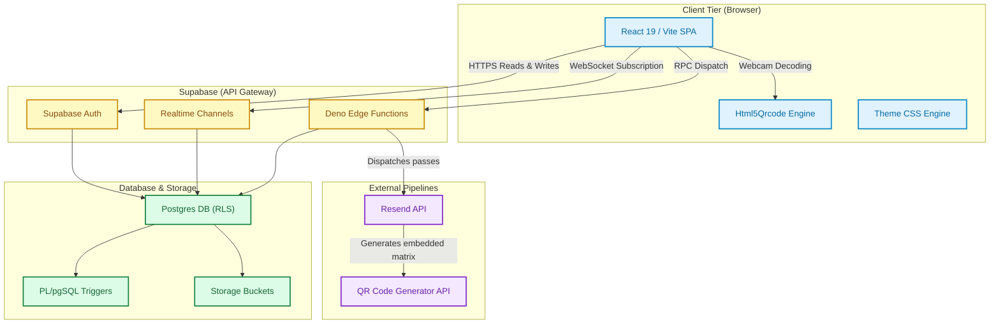
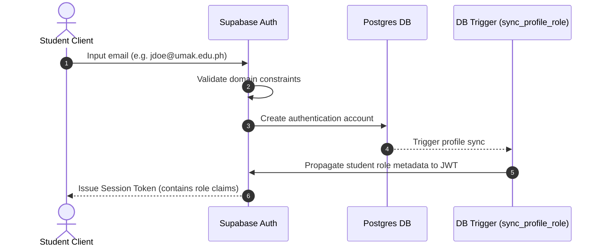
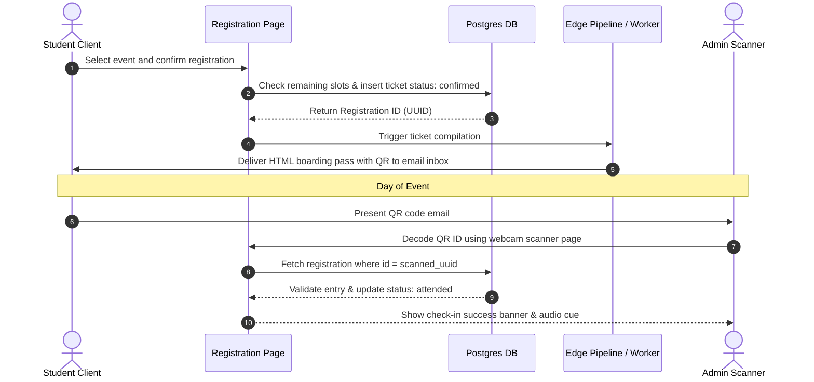

# 🏗️ System Architecture & Tech Stack

This chapter describes the high-level system architecture, technology selections, and runtime data flows for the CCIS Centralized Platform.

---

## 🌐 1. Architectural Overview

The application follows a decoupled **Client-Server-BaaS** paradigm designed to minimize hosting costs while ensuring rapid reactivity:

---

## 🛠️ 2. Detailed Tech Stack

### Frontend Tier
* **React 19 & TypeScript**: Provides type safety matched exactly to the database schema. High efficiency rendering with React hooks.
* **Vite 6**: Used for super fast hot reloading during dev and optimized Rollup tree-shaking for builds.
* **Tailwind CSS v4**: Utility styles combined with reactive CSS variables for on-the-fly colors.
* **GSAP (GreenSock)**: Orchestrates hardware-accelerated micro-animations, loading covers, page entry sweeps, and dynamic tab sweeps.
* **Html5Qrcode**: Local library using canvas arrays to analyze video stream frames and decode ticket QR matrices offline (no external camera-server calls needed during scan).

### Backend-as-a-Service (BaaS) Tier (Supabase)
* **Supabase Database**: PostgreSQL relational database with multi-table links, views, and indexes.
* **Row-Level Security (RLS)**: Fine-grained security constraints defined at the SQL layer, preventing unauthorized updates from the browser.
* **Realtime Websockets**: Listens for message inputs in active support chats and instant announcement notifications, updating views immediately without user refreshes.
* **Supabase Storage**: Bucket directories storing photobooth layouts, student profile photos, event posters, and bukaskaban PDFs.

### Transactional Email Pipeline
To avoid storing credentials in the browser, email generation runs in serverless contexts:
1. **Edge Function**: A Deno-based function (`send-ticket-email`) triggered via database changes or directly invoked via RPC, which integrates with **Resend** to dispatch tickets.
2. **Local Worker Daemon**: If Supabase serverless budgets are exceeded, a local script (`email-worker.js`) polls database registers to process queue tasks and deliver emails directly through SMTP.

---

## 🔄 3. Core Functional Data Flows

### A. domain-Locked Sign-Up Flow

### B. Event Ticketing & Verification Flow

